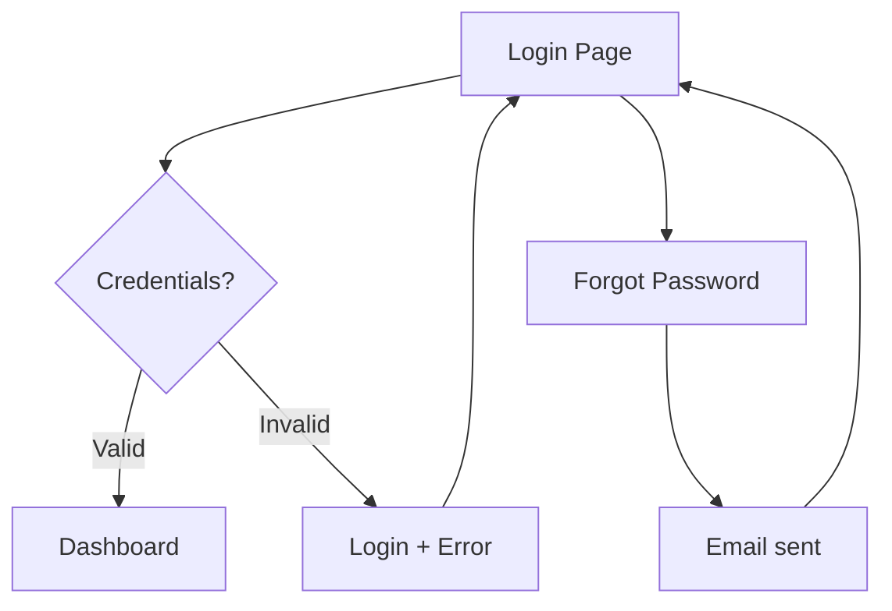

# UX Flow Mapping

Skill operativo del UX Designer para traducir UCs funcionales en flows navegables. La filosofía: si necesitás explicar el flow al usuario, el flow está mal.

## Procedimiento

### Paso 1: Inventario de UCs

Leer `01-functional-spec.md` y listar todos los UCs (UC-001, UC-002, ...). Para cada uno, anotar:
- Actor primario
- Goal
- Pre-condiciones
- Post-condiciones

### Paso 2: Para cada UC, mapear el flow

#### Estructura del flow

```
Flow F-001: <nombre> (mapea a UC-001)

Trigger: <qué dispara este flow>
Goal: <qué quiere lograr el usuario>
Success metric: <cómo medimos que funcionó>

Happy path:
[Entry] → Screen A → Action 1 → Screen B → Action 2 → [Success]

Alternative paths:
- After Action 1, if error: → Error Screen → Retry / Cancel
- After Action 2, if validation fails: → Screen B (with errors)
- User cancels: → Confirmation → [Exit]
```

#### Pantallas involucradas

Para cada screen del flow:

| Screen ID | Nombre | Componentes principales | Estados |
|---|---|---|---|
| P-001 | Login | Form, error banner, link recovery | loading, error, success |

#### Estados OBLIGATORIOS por pantalla

Toda pantalla debe tener diseñados estos estados, no solo el "happy":
- **Loading**: skeleton, spinner, o progress bar según contexto
- **Empty**: cuando no hay datos a mostrar (lista vacía, no results)
- **Error**: error recuperable con CTA claro
- **Success**: confirmación visual del resultado
- **Permission denied**: si el usuario no tiene acceso (no 404 genérico)
- **Offline / sin conexión**: para mobile o critical web flows

#### Edge cases obligatorios por flow

Listar y diseñar respuesta para:

- ¿Qué pasa si la sesión expira a mitad del flow?
- ¿Qué pasa si el usuario hace "back" del navegador?
- ¿Qué pasa si el usuario abre el mismo flow en dos tabs?
- ¿Qué pasa si la conexión se cae después de una acción crítica?
- ¿Qué pasa si el usuario tiene permisos parciales (puede A pero no B)?
- ¿Qué pasa con datos desactualizados (alguien más editó el recurso)?
- ¿Qué pasa con datos huérfanos si una entidad relacionada se borra?

### Paso 3: Diagramar el flow

Notación recomendada: ASCII art para específicos, Mermaid para complejos.

**ASCII (default, fácil de versionar)**:

```
[Login Page]
     │
     ├── Submit valid credentials ──> [Dashboard]
     │
     ├── Submit invalid ──> [Login + Error] ──> Retry
     │
     └── Forgot password ──> [Reset Page] ──> Email sent ──> [Login]
```

**Mermaid (cuando el flow es complejo)**:



### Paso 4: Identificar componentes reutilizables

Lista de componentes que aparecen en múltiples flows. Pasarlos a el UI Designer:

| Componente | Aparece en flows | Variantes necesarias |
|---|---|---|
| FormField | Login, Signup, Settings | text, email, password, textarea |
| ErrorBanner | Todos | error, warning, info |
| Pagination | Productor list, History | numbered, cursor |

### Paso 5: Cross-review con el Software Architect

Identificar decisiones de UX que tienen implicancias arquitectónicas:

| Decisión UX | Implicación arquitectónica | Quien decide final |
|---|---|---|
| Updates en tiempo real en dashboard | WebSockets o polling | el Software Architect + el UX Designer |
| Búsqueda con autocompletado | Necesita índice + endpoint dedicado | el Software Architect + el API Architect |
| Offline-first en mobile | Local storage strategy + sync | el Software Architect + el Mobile Developer |
| Multi-tab consistency | Broadcast channel / shared state | el Software Architect + el Frontend Developer |

Estos puntos van al gate report del Software Architect para resolución conjunta antes de Gate 3B.

### Paso 6: Validación de accesibilidad

Para cada flow, verificar:

- [ ] Es navegable solo con teclado (Tab + Enter + Esc)
- [ ] Screen reader entiende la estructura (h1, h2, landmarks, ARIA)
- [ ] Errores son anunciados (role="alert" o aria-live)
- [ ] Focus management: después de submit, el focus va a confirmation
- [ ] No hay traps de teclado en modales
- [ ] Contraste de color verificado contra fondos reales
- [ ] No depende solo del color (íconos + texto, no solo color rojo)
- [ ] Form labels asociados a inputs
- [ ] Timeouts configurables o avisos antes de expirar

## Output esperado

`docs/context/03-ux-spec.md` con:

1. **Information Architecture** (sitemap)
2. **Por cada flow F-NNN**:
   - Diagrama
   - Lista de pantallas
   - Estados por pantalla
   - Edge cases
3. **Inventario de componentes reutilizables** (pasar a el UI Designer)
4. **Decisiones cross-architecture** (revisar con el Software Architect)
5. **Checklist de accesibilidad WCAG 2.1 AA** aplicado
6. **Decisiones de UX clave justificadas** (con razón)

## Anti-patterns

- **Solo happy path**: si no diseñaste los error states, no diseñaste el flow.
- **Flow de >7 pasos sin justificación**: la mayoría de flows funcionan en ≤5 pasos.
- **Inventar componentes para una sola pantalla**: si solo se usa una vez, no es del sistema.
- **Ignorar back button del navegador**: el navegador es parte de la UX.
- **Asumir conexión always-on en mobile**: red móvil falla. Diseñá para eso.

## Checklist final

- [ ] Todos los UCs del Business Analyst tienen un flow asociado
- [ ] Cada flow tiene happy + alternative paths
- [ ] Cada pantalla tiene los 5 estados obligatorios diseñados
- [ ] Edge cases listados y respondidos
- [ ] Componentes reutilizables identificados
- [ ] Decisiones cross-architecture marcadas
- [ ] Accesibilidad WCAG AA verificada
